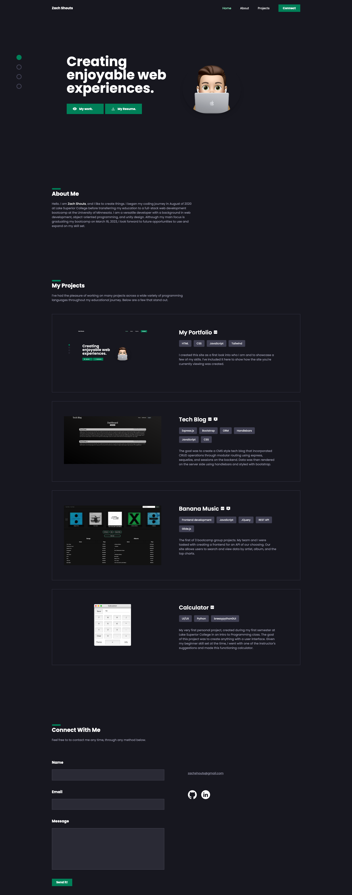

# Zach Shouts' Portfolio

## Table of Contents

- [Overview](#overview)

- [Live Site](#live-site)

- [Features](#features)

## Overview

I created this portfolio for one reason, and it's that I wanted a way to show pieces of my resume in a fun way. My portfolio is a place to see some of my skills and learn a bit about me. Through this portfolio I am able to show off some of my projects, provide a little more information about who I am along with access to my resume, and provide a way to contact me.

## Live Site

[Click to view the live site](https://zachshouts.github.io/portfolio/)

## Features

Some fun features that I was able to learn/utilize:

- The ability to send me an email through a form with formspree

- Navigation dots that follow where you are on the page

- The ability to download my resume with the click of a button